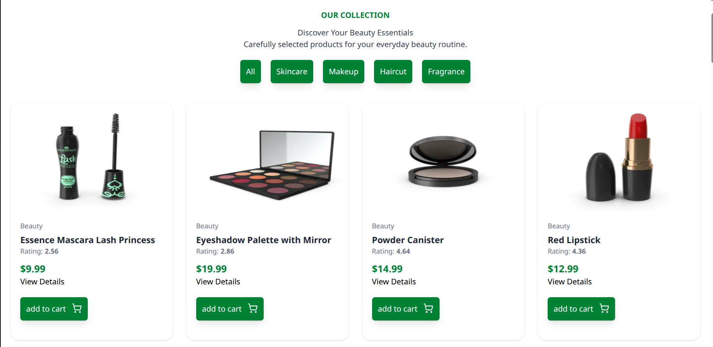
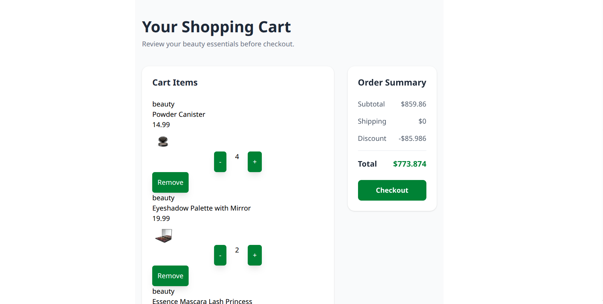
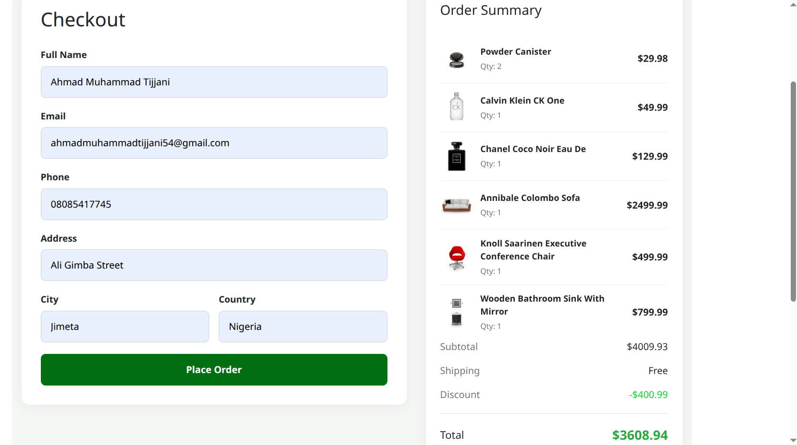

# 🌿 Naturèlle — Skincare E-Commerce

Naturèlle is a modern skincare e-commerce website built with **React**. The project focuses on creating a clean shopping experience with dynamic products, routing, cart functionality, and persistent cart data.

> 🚧 **Status:** Work in Progress

## ✨ Features

* 🛍️ Dynamic product listing
* 🔎 Product details page
* 🛒 Add products to cart
* ➕ Increase product quantity
* ➖ Decrease product quantity
* 🗑️ Remove products from cart
* 💰 Automatic subtotal calculation
* 🚚 Shipping calculation
* 🏷️ Discount calculation
* 🧮 Automatic total calculation
* 💾 Cart persistence using `localStorage`
* 📱 Responsive design
* 🧭 Navigation with React Router

## 🛠️ Technologies

* React
* JavaScript
* React Router
* Tailwind CSS
* Context API
* LocalStorage
* Lucide React
* DummyJSON API

## 🧠 What I Learned

While building Naturèlle, I practiced:

* React Context API for global cart state
* `useState` and `useEffect`
* `map()`, `filter()`, `find()`, and `reduce()`
* Dynamic routing and product details
* Working with API data
* Managing cart quantities
* Calculating ecommerce totals
* Persisting data with `localStorage`
* Using `JSON.stringify()` and `JSON.parse()`

## 📂 Main Features Structure

```text
src/
├── components/
│   └── ProductCard.jsx
├── context/
│   └── CartContext.jsx
├── pages/
│   ├── Home.jsx
│   ├── Products.jsx
│   ├── Product.jsx
│   ├── Cart.jsx
│   └── About.jsx
├── layouts/
│   └── RootLayout.jsx
├── App.jsx
└── main.jsx
```

📸 Screenshots
### 🏠 Home Page


### 🛍️ Products Page



### 🛒 Shopping Cart



### Checkout Page



## 🚀 Getting Started

Clone the repository:

```bash
git clone YOUR_REPOSITORY_URL
```

Move into the project:

```bash
cd naturelle
```

Install dependencies:

```bash
npm install
```

Start the development server:

```bash
npm run dev
```

Then open the local development URL shown in your terminal.

## 📌 Project Status

Naturèlle is still under development.

Future improvements may include:

* Checkout functionality
* Payment integration
* Product search and filtering
* Better product categories
* User authentication
* Improved animations
* Backend integration

## 👨‍💻 Author

**Ahmad Muhammad Tijjani**

Frontend Developer | React Developer

Built with ❤️ while learning and improving every day.
